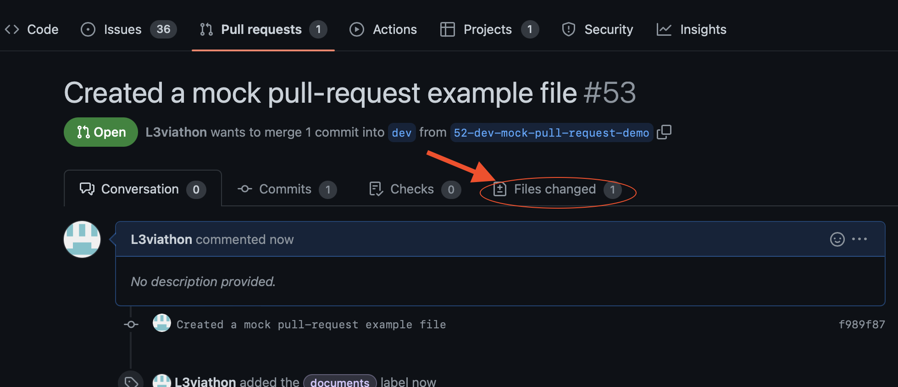

# Team Branching Guidelines 

### Navigation:
1. Important reminders:
    - [Clone Amplifier into your computer.](#remember-to-clone-our-github-repo-is-cloned-into-your-computer) 
    - [Before starting anything, make sure your dev branch is up to date...pull!](#before-starting-anything-make-sure-your-dev-branch-is-up-to-date)
    - If you have conflicting or diverget branches, BEFORE merging, talk to Calvin or Patrick.
    - [If you created a branch, and updates were made in dev... merge.](#if-you-created-a-branch-and-updates-in-dev-were-made-merge)
    - [Only make changes in your own branch. Switch! Don't make changes to dev!](#always-remember-to-switch-to-your-respective-branch-to-make-changes-please-do-not-make-changes-to-dev)
    - Always request reviews from Patrick. Patrick will in turn request reviews from Calvin. Calvin will request reviews from Patrick or Levi.
2. [How to create a branch from your assigned issue](#creating-your-branch-from-your-assigned-issue)
3. [How to create Pull Requests](#creating-a-pull-request)
4. [Reviewing Pull Requests](#reviewing-pull-requests)
5. [Merging into dev (for Gitflow master Patrick)](#merging-into-the-dev-branch)

 

### Remember to clone our GitHub Repo is cloned into your computer!
`git clone (remote_repo_link)`
- [Team Amplifier Project 2 Repo](https://github.com/FullSol/amplifire)
 

### Before starting anything, make sure your dev branch is up to date.
1. `cd amplifire`
2. Confirm you're in the _dev_ branch. If not, commit or stash your changes in the branch you're in, and `git switch dev` (switch your branch to dev).
3. `git pull`.
    - This will fetch and download content from a remote repository and immediately update the local repository to match that content.
 

### If you created a branch, and updates in dev were made... merge.
1. Save and `git commit` or `git stash` your work on the branch you're working on.
2. `git switch dev`
3. `git pull`.
4. `git switch (branch you want to keep working on)` : Return to the branch you're working on.
5. `git merge` -> (if needed) `:wq`
    - This will merge the updates from the dev branch to the branch that you're currently in so that you can work with the most recent changes. 
 

### ALWAYS REMEMBER TO SWITCH TO YOUR RESPECTIVE BRANCH TO MAKE CHANGES. PLEASE DO NOT MAKE CHANGES TO DEV.
1. `git switch (your branch based on the issue you're working on)`

>Our Gitflow master, Patrick (and others), will be the only one who can merge any changes you made in your branch to dev after reviewing. That said, remember to always add Patrick and Calvin in your pull requests.
 

### Creating your branch from your assigned issue:
1. Navigate to the Issues tab.

2. Select the Issue that you've been assigned to and want to work on.

3. Go to Development. Click on "Create a branch".

4.

- Select **"Create branch."**  
- Our branch source will always be "dev". Calvin has already set it as our default, so we don't need to worry about it. 

5. Copy and paste the following code into your terminal. (Make you have `git pull` in our dev branch so you're up to date first!)

6. When you created your branch, your issue should look sometthing like this:

- Your branch should be under Development.
 

### Creating a pull request:
1. _Once you have finished your work issue or are ready to commit to ask others to review your work, remember to save your changes, commit them, and push them. This will be from the branch that you're in._
    1. `git add (file name)` or `git add .` (if you're ready to commit everything)
    2. `git commit -m "(your_message)"
    3. `git push`
2. Awesome work! Now... navigate to our GitHub remote repository. For quick access, here is the [link](https://github.com/FullSol/amplifire).
3. You should see the following:

4. Click on **Compare & Pull Request**
5. You should see the following:

    - *Reviewers*: No matter what, **please request reviews from Patrick.**.
    - *Assignee*:  Yourself
    - *Labels*: This will match your issue label.
    - *Projects*: Team Amplifier (seting this will update our project board)
    - *Milestones*: Will match your issue
6. Add any comments you want to make.
7. Click **Create pull request**
8. When this has been reviewed and approved, Patrick will go ahead and merge this into the dev branch. Merging into the dev is most likely going to happen every day, if not several times a day as we get closer to the deadline, so no matter what, remember: `git pull` in your dev branch!

### Reviewing Pull Requests
1. When a team member creates a pull request, and assigns you as a reviewer, you will
    1. receive an email notification and
    2. will have a notification near the top of your screen when you access our Amplifier remote repo.
2. Go to that pull request. 
    - If there is an icon at the top of your screen that asks you to review changes, select it. Otherwise...
3. In that pull request (which you have been assigned to review), go to the "Files Changed" tab.

4. Review the files. 

    - **Red highlight** = what was changed ; **Green highlight** = New changes
    - While reviewing, if you notice a mistake or want to comment on a specific line, hover over that line and select the blue plus symbol (on the left side of your screen) to "Add a Comment" or "Start a review".
        - **Start a review**: Use this when you have several files to review with multiple comments. The notifications the assignee will receive (when you're done reviewing) will compile all of your review comments into a single email, instead of an emailing the assignee for every single comment.
5. Once you're finished reviewing, select "Review changes" at the top right corner of your screen.

- Write any overarching comments you have and either "**Approve**" or "**Request changes**".
    - *Approve* if all of the changes that were made are good to go.
    - *Request changes* if changes need to be made.
6. Remember to select "**Submit review**" to complete your review.

### Merging into the dev branch

1. If this hasn't been done already, make sure to comment "Closes #(the number of the issue)".
    - For your reference: The branch that you're going to be merging will have the number of the issue on it.
2. If all the changes made have no conflict with the dev branch, go ahead and **Merge pull request**.
3. If there are conflicting branches that need to be resolved before merging, talk to Calvin.
4. Once you have finished merging, there should be an option to delete that branch. Go ahead and delete.

**If you're ever unsure, please feel free to reach out to Calvin.